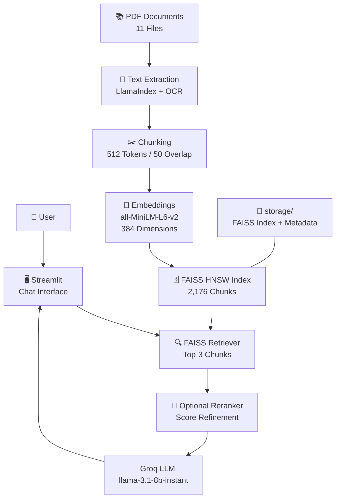

# 📚 RAG Chatbot – Ask Questions from Your PDF Books

<p align="center">
  
  
  
  
  
  
  
</p>

<p align="center">
  <b>🤖 Ask questions from your personal book collection • ⚡ 2-3 second responses • 📎 Source citations included</b>
</p>

---

## 📖 Table of Contents

- [Overview](#-overview)
- [Features](#-features)
- [Architecture](#-architecture)
- [Tech Stack](#-tech-stack)
- [Project Structure](#-project-structure)
- [Quick Start](#-quick-start)
- [Configuration](#-configuration)
- [Sample Questions](#-sample-questions)
- [Performance](#-performance)
- [How It Works](#-how-it-works)
- [Screenshots](#-screenshots)
- [Contributing](#-contributing)
- [License](#-license)
- [Acknowledgments](#-acknowledgments)
- [Contact](#-contact)

---

## 🎯 Overview

This is a **Production-Ready Retrieval-Augmented Generation (RAG) Chatbot** that answers questions from a collection of PDF books. It combines:

- **FAISS** for fast vector similarity search
- **Groq's LLM** for lightning-fast response generation
- **LlamaIndex** for seamless RAG pipeline
- **Streamlit** for a beautiful ChatGPT-style interface

The system processes 11 self-help and philosophy books (200+ pages each), chunks them into 2,176 passages, and provides accurate answers with **source citations** in under **3 seconds**.

---

## ✨ Features

| Feature | Description |
|---------|-------------|
| 📄 **PDF Ingestion** | Supports both text-based and scanned PDFs with Tesseract OCR fallback |
| 🔍 **Smart Retrieval** | FAISS HNSW index for sub-100ms similarity search |
| 🧠 **Accurate Generation** | Groq's `gpt-oss-120b` for fast, high-quality responses |
| 📎 **Source Citations** | Every answer includes PDF name and page number |
| ⚡ **Fast Performance** | 2-3 second average response time |
| 💾 **Persistent Index** | Index cached after first run – instant loading on subsequent starts |
| 🎨 **Beautiful UI** | ChatGPT-style interface with modern, elegant design |
| 🔓 **Open Source** | Fully free and open-source stack |
| 🔧 **Configurable** | Easily adjust chunk size, overlap, top-K, and models via `.env` |
| 📊 **Performance Metrics** | Response time and relevance scores displayed for each query |

---

## 🏗️ System Architecture



### 🔄 RAG Workflow

1. **User Query** → User enters a question through the Streamlit chat interface.
2. **Retrieval** → FAISS searches the vector index and retrieves the top 3 relevant chunks.
3. **Reranking** → An optional reranker refines the retrieved results based on relevance.
4. **Context + Query** → The selected chunks are combined with the user's question.
5. **LLM Generation** → Groq's `llama-3.1-8b-instant` generates the final answer.
6. **Response** → The generated response is displayed in the Streamlit interface.

### 📚 Document Ingestion Workflow

1. **PDF Upload** → 11 PDF documents are provided as the knowledge source.
2. **Text Extraction** → Text is extracted using LlamaIndex with OCR support.
3. **Chunking** → Documents are divided into chunks of approximately 512 tokens with 50-token overlap.
4. **Embedding Generation** → `all-MiniLM-L6-v2` converts each chunk into a 384-dimensional vector.
5. **FAISS Indexing** → 2,176 chunks are stored in a FAISS HNSW vector index.
6. **Persistence** → The FAISS index and metadata are stored locally in the `storage/` directory.
---

## 🛠️ Tech Stack

| Component | Technology | Version | Why Chosen |
|-----------|------------|---------|------------|
| **PDF Processing** | PyMuPDF + Tesseract OCR | 1.28.2+ | Handles both text and scanned pages |
| **Chunking** | LlamaIndex SentenceSplitter | 0.10+ | Smart splitting with overlap for context |
| **Embeddings** | all-MiniLM-L6-v2 (HuggingFace) | 2.2.0+ | Fast, free, 384-dim vectors, good accuracy |
| **Vector DB** | FAISS (HNSW index) | 1.7.4+ | Fast similarity search, open-source |
| **LLM** | Groq (gpt-oss-120b) | API | Extremely fast (2-3s responses) |
| **RAG Framework** | LlamaIndex | 0.10+ | Unified pipeline, easy integration |
| **UI** | Streamlit | 1.28+ | Quick prototyping, interactive |
| **Language** | Python | 3.9+ | Extensive ML/AI ecosystem |

---

## 📂 Project Structure

```text
Beacon-RAG-Chatbot/
│
├── app.py
│   └── 🎨 Streamlit UI with ChatGPT-style interface
│
├── ingestion.py
│   └── 📄 PDF ingestion with OCR fallback
│
├── index.py
│   └── 🔍 FAISS index creation, persistence & loading
│
├── rag.py
│   └── 🧠 RAG pipeline — retriever, LLM & response generation
│
├── utils.py
│   └── 🔧 Environment variables and utility functions
│
├── run.py
│   └── 🖥️ Optional CLI-based testing
│
├── requirements.txt
│   └── 📦 Python dependencies
│
├── .env.example
│   └── 📝 Environment variable template
│
├── .gitignore
│   └── 🚫 Files and folders excluded from Git
│
├── LICENSE
│   └── 📄 MIT License
│
├── README.md
│   └── 📖 Project documentation
│
├── pdfs/
│   ├── 📁 PDF knowledge base
│   ├── document_01.pdf
│   ├── document_02.pdf
│   ├── ...
│   └── document_11.pdf
│
└── storage/
    ├── docstore.json
    │   └── 📄 Document chunks & metadata
    │
    ├── faiss.index
    │   └── 🔍 FAISS vector index
    │
    └── index_store.json
        └── 🗂️ Index metadata
```


## 🚀 Quick Start

### Prerequisites

- **Python 3.9+** – [Download](https://www.python.org/downloads/)
- **Groq API Key** – [Get one here](https://console.groq.com/) (Free tier available)
- **Git** – [Download](https://git-scm.com/)
- **10+ PDF books** (200+ pages each) for testing

### Installation

**1. Clone the repository**
```bash
git clone https://github.com/Maheshkhule/Beacon---rag-Chatbot.git
cd Beacon---rag-Chatbot

2. Create virtual environment
# Windows
python -m venv .venv
.venv\Scripts\activate

# macOS/Linux
python3 -m venv .venv
source .venv/bin/activate

3. Install dependencies
pip install -r requirements.txt

4. Set up environment variables
# Copy the example .env file
cp .env.example .env

# Edit .env and add your Groq API key
# GROQ_API_KEY=your_api_key_here

5. Add your PDF books
# Create the pdfs folder if it doesn't exist
mkdir pdfs

# Place your PDF files in the pdfs/ folder
# Example:
cp /path/to/your/books/*.pdf pdfs/

6. Run the app
streamlit run app.py

7. Open your browser
Navigate to http://localhost:8501
Note: The first run will take 15-30 minutes to ingest and index all PDFs. Subsequent runs will load instantly from cache.

🔧 Configuration
Edit .env to customize your setup:

# ============================================
# REQUIRED - Groq API Configuration
# ============================================
GROQ_API_KEY=your_groq_api_key_here

# ============================================
# Folder Paths
# ============================================
PDF_FOLDER=pdfs              # Folder containing your PDF books
STORAGE_FOLDER=storage       # Folder for persisted FAISS index

# ============================================
# Model Configuration
# ============================================
# Embedding model (free, open-source)
EMBED_MODEL=sentence-transformers/all-MiniLM-L6-v2

# Chunking parameters
CHUNK_SIZE=512               # Tokens per chunk
CHUNK_OVERLAP=50             # Overlap between chunks

# Retrieval parameters
TOP_K=3                      # Number of chunks to retrieve

# LLM Model (Groq)
LLM_MODEL=gpt-oss-120b

**💬 Sample Questions**
Personal Development
"What are the main principles of self-healing?"

"How does Stoicism help with daily challenges?"

"What is the 'garden of the mind' metaphor?"

"How can I overcome fear and take action?"

Philosophy & Psychology
"How does Eckhart Tolle define the ego?"

"What are Jordan Peterson's rules for life?"

"What does 'As a Man Thinketh' say about character?"

"How does 'The Power of Manifestation' work?"

Cross-Book Comparisons
"Compare the happiness philosophies in different books"

"How does 'Think and Grow Rich' compare to 'As a Man Thinketh'?"

"What do different books say about overcoming fear?"

"Compare Stoicism with modern self-help approaches"

Specific Book Questions
"What are the 6 steps to turn desire into reality according to Think and Grow Rich?"

"What are the Seven Virtues taught in The Monk Who Sold His Ferrari?"

"How does Do What You Are use Myers-Briggs for career guidance?"


🧠 How It Works
1. Ingestion Pipeline
PDF Reading: PyMuPDF extracts text from PDFs

OCR Fallback: Tesseract handles scanned pages

Text Cleaning: Headers, footers, and special characters are removed

Chunking: Documents split into overlapping chunks (512 tokens, 50-token overlap)

Metadata: Each chunk stores filename, page number, and chunk ID

2. Embedding & Indexing
Embedding: Each chunk → 384-dim vector using all-MiniLM-L6-v2

Indexing: FAISS builds HNSW graph for fast similarity search

Persistence: Index saved to disk for instant loading

3. Query & Response
User Query → Embedded to 384-dim vector

FAISS Search: Finds top-3 most similar chunks

Context Building: Retrieved chunks form the context

LLM Generation: Groq generates answer based ONLY on context

Source Citations: Each answer includes file name + page number
